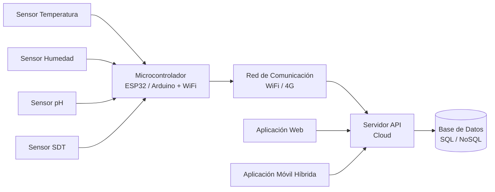
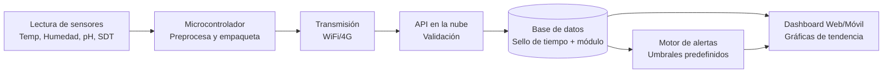
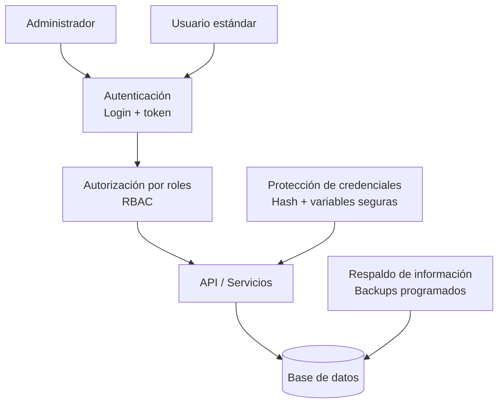

# 5. Implementación y arquitectura de la solución IoT

## 5.1. Implementación en campo y periodo de operación

El sistema IoT fue instalado y puesto en operación en **[ubicación exacta de instalación]**, dentro de un entorno **[invernadero/laboratorio/planta piloto/explotación productiva]** con condiciones controladas para monitoreo continuo de variables fisicoquímicas.

La solución operó durante un periodo de **6 meses**, en el cual se realizó captura, transmisión, almacenamiento y visualización de datos en tiempo real. Durante este periodo se monitorearon de manera permanente las siguientes variables:

- **Temperatura**
- **Humedad**
- **pH**
- **Sólidos Disueltos Totales (SDT)**

La implementación permitió validar tanto la estabilidad de la adquisición de datos como la disponibilidad de la plataforma para consulta histórica y seguimiento operativo.

---

## 5.2. Arquitectura de la solución IoT

La arquitectura de la solución se diseñó bajo un enfoque modular, escalable y orientado a servicios, integrando capa de percepción (sensores), capa de comunicación, capa de procesamiento/almacenamiento y capa de aplicación (visualización y gestión).

Para la documentación de esta arquitectura se incluyen tres vistas complementarias:

1. **Arquitectura física**
2. **Flujo de datos**
3. **Arquitectura lógica y seguridad**

### Figura X. Arquitectura física del sistema

La **Figura X** presenta la arquitectura general de la solución IoT. Los sensores de **temperatura, humedad, pH y SDT** se conectaron a una tarjeta de adquisición **[ESP32 / Arduino + módulo WiFi]**, la cual envió los datos a través de una red **[WiFi/4G]** hacia un servidor en la nube.

En el servidor se desplegaron los servicios de API y la base de datos **[tipo de base de datos]**, habilitando el consumo de información desde una aplicación web y una aplicación móvil híbrida para consulta y gestión de las lecturas.

### Figura Y. Flujo de datos

La **Figura Y** muestra el flujo de datos desde la adquisición en el módulo acuapónico hasta la visualización. Cada lectura fue registrada con sello de tiempo y asociada al módulo de cultivo correspondiente. A partir de esta información se generaron gráficos de tendencia y alertas automáticas cuando las variables excedieron umbrales predefinidos.

### Figura Z. Arquitectura lógica y seguridad

En la **Figura Z** se esquematizan los principales controles de seguridad implementados: autenticación de usuarios, segmentación por roles (**administrador** y **usuario estándar**), protección de credenciales y políticas básicas de respaldo de la información.

---

## 5.2.1. Arquitectura física del sistema

La arquitectura física se compone de los siguientes elementos principales:

- **Capa de sensado:** sensores para temperatura, humedad, pH y SDT instalados en puntos estratégicos del módulo acuapónico.
- **Capa de adquisición:** microcontrolador **[ESP32/Arduino]** encargado de leer señales analógicas/digitales y preparar la carga útil.
- **Capa de conectividad:** enlace de comunicación **[WiFi/4G]** para transferencia de datos hacia la nube.
- **Capa de servicios en la nube:** API para recepción y consulta de datos, además de servicios de autenticación y gestión.
- **Capa de persistencia:** base de datos **[SQL/NoSQL]** para almacenamiento histórico y trazabilidad de mediciones.
- **Capa de visualización:** interfaz web y aplicación móvil híbrida para supervisión operativa y análisis.

Esta estructura permite desacoplar la adquisición de datos de su consumo, facilitando mantenimiento y escalabilidad.

---

## 5.2.2. Flujo de datos

El flujo funcional del sistema se desarrolló en cinco etapas:

1. **Captura:** los sensores realizan mediciones periódicas de temperatura, humedad, pH y SDT.
2. **Preprocesamiento y transmisión:** el microcontrolador estructura los datos y los envía mediante red **[WiFi/4G]**.
3. **Recepción y almacenamiento:** la API valida el mensaje y persiste la lectura con marca temporal en la base de datos.
4. **Visualización y analítica:** la información se presenta en paneles con series temporales y métricas de estado.
5. **Gestión de alertas:** se comparan lecturas contra umbrales definidos; cuando hay desviaciones se generan notificaciones.

Este flujo garantiza trazabilidad desde la captura en campo hasta la toma de decisiones soportada en datos.

---

## 5.2.3. Arquitectura lógica y seguridad

La arquitectura lógica se estructuró por capas funcionales y controles de acceso:

- **Capa de presentación:** clientes web y móvil para consulta y operación.
- **Capa de servicios/API:** lógica de negocio, validación de peticiones y exposición de endpoints.
- **Capa de datos:** persistencia de lecturas, usuarios, roles y configuraciones.

En seguridad, se implementaron los siguientes controles:

- **Autenticación de usuarios** para acceso a la plataforma.
- **Autorización por roles** (administrador/usuario estándar) para restringir operaciones críticas.
- **Protección de credenciales** en tránsito y almacenamiento conforme a buenas prácticas.
- **Políticas de respaldo básico** para preservar integridad y disponibilidad de la información.

Esta arquitectura permite operar el sistema con criterios mínimos de confidencialidad, integridad y disponibilidad.

---

## Anexo para Word: texto de pie de figura sugerido

- **Figura X.** Arquitectura física de la solución IoT para monitoreo de variables en módulo acuapónico.
- **Figura Y.** Flujo de datos desde la captura de sensores hasta visualización y generación de alertas.
- **Figura Z.** Arquitectura lógica y puntos de control de seguridad del sistema.

---

## Mermaid (fuente editable de las 3 figuras)

### Figura X — Arquitectura física

### Figura Y — Flujo de datos

### Figura Z — Arquitectura lógica y seguridad

---

## Recomendación de uso en Word

1. Copia el contenido de cada subsección directamente al documento.
2. Genera las figuras desde Mermaid (o usa draw.io/Visio) con base en los diagramas anteriores.
3. Inserta cada imagen como Figura X, Y y Z.
4. Actualiza los campos en corchetes **[ ]** con datos específicos de tu implementación real.
